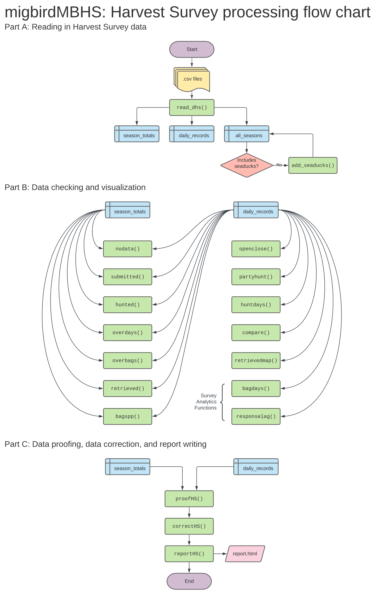

<!-- README.md is generated from README.Rmd. Please edit that file -->

# migbirdMBHS

## Overview

The migbirdMBHS package provides an easy-to-use set of R functions for
the U.S. Fish and Wildlife Service Migratory Bird Program to process
online [Harvest Survey](https://www.fws.gov/harvestsurvey) data.

Tasks that can be accomplished with this package include:

  - `read_dhs` imports data
  - `add_seaducks` appends seaduck season info to the reference table
  - `submitted` reports proportion of non-finalized hunts
  - `hunted` reports proportion of hunters who did not hunt
  - `nodata` checks for any missing data that was expected
  - `partyhunt` checks for group hunts
  - `overdays` checks if number of days hunted exceeds hunting season
  - `overbags` checks for abnormally high bag sizes
  - `openclose` checks to see if harvest date falls outside the season
  - `huntdays` summarizes the total number of days hunted
  - `retrieved` summarizes the total number of bids retrieved
  - `retrievedmap` maps the mean retrieved per state and species
  - `responselag` visualizes time between hunt date and response date
  - `bagdays` summarizes days hunted per hunter and species group
  - `bagspp` summarizes species hunted by popularity
  - `compare` visualizes differences between daily and season data
  - `proofHS` \[coming soon\]
  - `correctHS` \[coming soon\]
  - Automated report writing with `reportHS` \[coming soon\]

## Installation

``` r
library(devtools)
install_github("USFWS/migbirdMBHS")
```

## Function Flow



## USFWS Disclaimer

The United States Fish and Wildlife Service (FWS) GitHub project code is
provided on an “as is” basis and the user assumes responsibility for its
use. FWS has relinquished control of the information and no longer has
responsibility to protect the integrity, confidentiality, or
availability of the information. Any reference to specific commercial
products, processes, or services by service mark, trademark,
manufacturer, or otherwise, does not constitute or imply their
endorsement, recommendation or favoring by FWS. The FWS seal and logo
shall not be used in any manner to imply endorsement of any commercial
product or activity by FWS or the United States Government.

## License

This project is licensed under the terms of the Creative Commons Zero
v1.0 Universal license.
