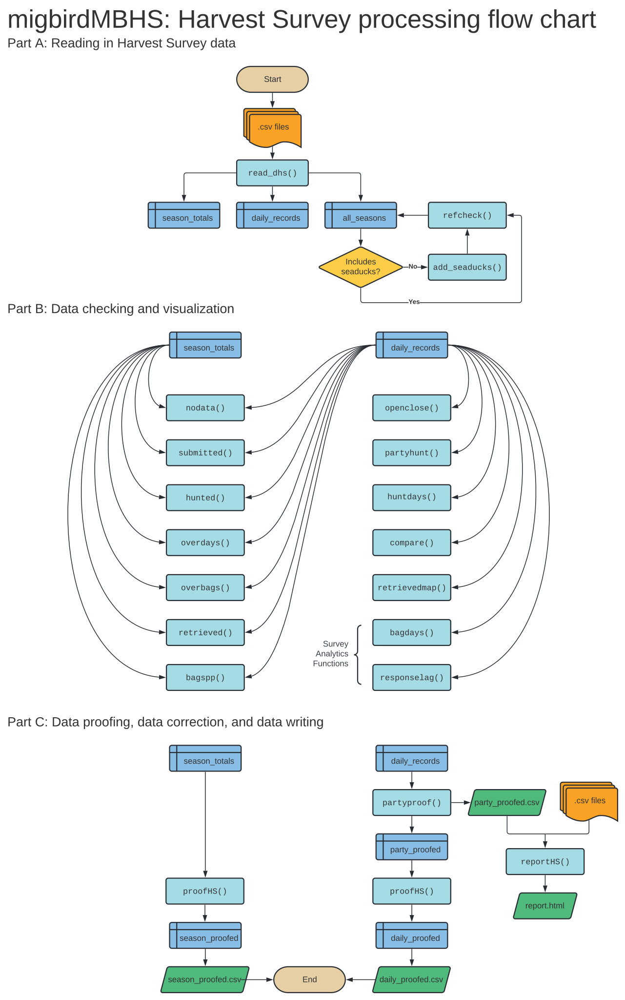

## Table of Contents

- [Introduction](#introduction)
    - [Installation](#installation)
    - [Functions overview](#functions-overview)
- [Part A: Data Import and Cleaning](#part-a-data-import-and-cleaning)
    - [read_dhs](#read_dhs)
    - [add_seaducks](#add_seaducks)
    - [refcheck](#refcheck)
- [Part B: Data Checking and Visualization](#part-b-data-checking-and-visualization)
    - [nodata](#nodata)
    - [submitted](#submitted)
    - [hunted](#hunted)
    - [overdays](#overdays)
    - [overbags](#overbags)
    - [retrieved](#retrieved)
    - [bagspp](#bagspp)
    - [openclose](#openclose)
    - [partyhunt](#partyhunt)
    - [huntdays](#huntdays)
    - [compare](#compare)
    - [retrievedmap](#retrievedmap)
    - [bagdays](#bagdays)
    - [responselag](#responselag)
- [Part C: Data Proofing and Report Writing](#part-c-data-proofing-and-report-writing)
    - Proofing 
        - [partyproof](#partyproof)
        - [proofHS](#proofhs)
    - Report writing
        - [reportHS](#reporths)
- [Troubleshooting](#troubleshooting)
    - [Issue reporting](#issue-reporting)

## Introduction

The *migbirdHS* package was created for the U.S. Fish and Wildlife Service (USFWS) to process online <a href = "https://www.fws.gov/harvestsurvey/">Harvest Survey</a> data.

### Installation

The package can be installed from the USFWS GitHub repository using:

```r
devtools::install_github("USFWS/migbirdHS", build_vignettes = T, upgrade = F, quiet = T)
```

### Functions overview

The flowchart below is a visual guide to the order in which functions are used. Some functions are only used situationally and some require manual input from the user. The general process of handling Harvest Survey data is demonstrated here; every function in the *migbirdHS* package is included.

<div class="figure" style="text-align: center">

<p class="caption">Overview of migbirdHS functions in a flowchart format.</p>
</div>

## Part A: Data Import and Cleaning

### read_dhs

The first step is to import the three Harvest Survey data tables: "daily_records", "season_totals", and "all_seasons". These data are used together or separately in all subsequent functions.

The `read_dhs` function can be used to read in the three data tables from .csv files to the R Global Environment. The `read_dhs` function will read in all three files for a specific year (e.g. `year = "2019"`). In the example below, we will read in data for 2020. 

Note: It is recommended to use a database connection rather than .csv files when accessing data for annual processing. The `read_dhs` function should be used in rare cases (e.g. running the package vignette, going through past data, etc). Please see alternate documentation to make a database connection.


```r
library(migbirdHS)

read_dhs("C:/HarvestSurvey/vignette/", year = "2020")
```

```
## <environment: R_GlobalEnv>
```

```r
daily_records <-
  daily_records |> 
  dplyr::mutate(record_id = dplyr::row_number()) |> 
  dplyr::relocate(record_id, .before = "surveyID")
```

```
## Error in eval(expr, envir, enclos): object 'daily_records' not found
```

### add_seaducks

The `add_seaducks` function adds seaduck bag and possession limits to the reference table. This is done in each state with seaduck harvest using the same values as ducks.


```r
all_seasons <- add_seaducks(all_seasons)
```

```
## Error in eval(expr, envir, enclos): object 'all_seasons' not found
```

### refcheck

Check to see if the reference table contains every reference value needed with the `refcheck` function. If anything is reported by this function, edit the reference table manually.


```r
refcheck(all_seasons)
```

```
## Error in eval(expr, envir, enclos): object 'all_seasons' not found
```

## Part B: Data Checking and Visualization

### nodata

The `nodata` function checks to see if any states or species are missing from the daily or season Harvest Survey data. If species are desired in the output, that can be specified with `species = "all"` or by using a species string. The species group can be one of: "Band-tailed Pigeon", "Coots", "Ducks", "Gallinules", "Geese", "Rails", "Sandhill Crane", "Snipe", "Specially Regulated Sea Ducks", or "Woodcock".

An additional parameter in this function is `report`, set to `FALSE` by default. When `report = FALSE` and running `nodata` on season totals, daily data are excluded from season totals. In the R markdown report template, this is set to `report = TRUE` and dailies are not excluded from season totals (to make the report more streamlined).

To demonstrate the use of `nodata` outside of a report, first we will check the daily data:


```r
nodata(daily_records, ref_data = all_seasons)
```

```
## Error in eval(expr, envir, enclos): object 'daily_records' not found
```

Then, we will check the season data:


```r
nodata(season_totals, ref_data = all_seasons)
```

```
## Error in eval(expr, envir, enclos): object 'season_totals' not found
```

We can include species for the season data:


```r
nodata(season_totals, ref_data = all_seasons, species = "all")
```

```
## Error in eval(expr, envir, enclos): object 'season_totals' not found
```

And we can specify which species we want to check, across all states:


```r
nodata(season_totals, ref_data = all_seasons, species = "Coots")
```

```
## Error in eval(expr, envir, enclos): object 'season_totals' not found
```


### submitted

The `submitted` function analyzes the number of Y and N responses for the has_submitted field. The function takes parameters `type` and `output`. Use `type = "totals"` (default) to view a summary, `type = "state"` to view proportions by state, and `type = "species"` to view proportions by species group. Use `output = "table"` (default) to get a table from the function, or specify `type = "plot"` to get a simple ggplot2 object.

This function does not filter out daily records from the season totals.

To demonstrate, first we will plot the total daily data:


```r
submitted(daily_records, type = "totals", output = "plot")
```

```
## Error in eval(expr, envir, enclos): object 'daily_records' not found
```

Next, we can create a table of the total daily data:


```r
submitted(daily_records, type = "totals", output = "table")
```

```
## Error in eval(expr, envir, enclos): object 'daily_records' not found
```

Switching to season data, we can create a plot first for `type = "totals"`:


```r
submitted(season_totals, type = "totals", output = "plot")
```

```
## Error in eval(expr, envir, enclos): object 'season_totals' not found
```

Then create a plot for `type = "state"`:


```r
submitted(season_totals, type = "state", output = "plot")
```

```
## Error in eval(expr, envir, enclos): object 'season_totals' not found
```

And finally, create a plot for `type = "species"`:


```r
submitted(season_totals, type = "species", output = "plot")
```

```
## Error in eval(expr, envir, enclos): object 'season_totals' not found
```


### hunted

The `hunted` function checks the "days_hunted" field in the season totals data or the "has_hunted" field in the daily data. The function takes parameters `type` and `output`. Use `type = "totals"` (default) to view a summary, `type = "state"` to view proportions by state, and `type = "species"` to view proportions by species group. Use `output = "table"` (default) to get a table from the function, or specify `type = "plot"` to get a simple ggplot2 object.

To demonstrate, first we will plot the total daily data:


```r
hunted(daily_records, type = "totals", output = "plot")
```

```
## Error in eval(expr, envir, enclos): object 'daily_records' not found
```

Next, we can create a table of the total daily data:


```r
hunted(daily_records, type = "totals", output = "table")
```

```
## Error in eval(expr, envir, enclos): object 'daily_records' not found
```

Switching to season data, we can create a plot first for `type = "totals"`:


```r
hunted(season_totals, type = "totals", output = "plot")
```

```
## Error in eval(expr, envir, enclos): object 'season_totals' not found
```

Then create a plot for `type = "state"`:


```r
hunted(season_totals, type = "state", output = "plot")
```

```
## Error in eval(expr, envir, enclos): object 'season_totals' not found
```

And finally, create a plot for `type = "species"`:


```r
hunted(season_totals, type = "species", output = "plot")
```

```
## Error in eval(expr, envir, enclos): object 'season_totals' not found
```

### overdays

The `overdays` function checks daily or season data to determine if total days hunted exceed the length of the state and species' season. If the season data are used in the function, daily data are filtered out of it. This helps to make direct comparisons between them.


```r
overdays(daily_records, ref_data = all_seasons)
```


```
## Error in eval(expr, envir, enclos): object 'all_seasons' not found
```


```r
overdays(season_totals, ref_data = all_seasons)
```


```
## Error in eval(expr, envir, enclos): object 'all_seasons' not found
```

### overbags

The `overbags` function checks for retrieved values over the bag limit per state and species in the daily data. All states are reported by default, but a specific state can be returned instead by using the `state` parameter (e.g. `state = "Alabama"`). The `summary` parameter can be set as TRUE to return a table summarized by state and species to report the max, min, and count of overbag values (defaults to FALSE). Lastly, the `over` parameter defaults to TRUE, but can be set as FALSE to return a table of all values (not just the overbags). 

The default settings can be used for a basic output:


```r
overbags(daily_records, ref_data = all_seasons)
```

```
## Error in eval(expr, envir, enclos): object 'all_seasons' not found
```

Using `summary = TRUE` returns an easy-to-read format:


```r
overbags(daily_records, ref_data = all_seasons, summary = TRUE)
```

```
## Error in eval(expr, envir, enclos): object 'all_seasons' not found
```

And we can specify a state:


```r
overbags(daily_records, ref_data = all_seasons, state = "Arkansas")
```

```
## Error in eval(expr, envir, enclos): object 'all_seasons' not found
```

### retrieved

The `retrieved` function summarizes the total number of birds retrieved in the daily or season data. The `output` can be set to "table" (default) or "plot". It can include "state", "species", or "both" (default) by using the `type` parameter. Also, the data can be returned as an `average` using TRUE (default), or return all birds retrieved (`average = FALSE`).

Let's use the most basic version of the function on the daily data:


```r
retrieved(daily_records)
```

```
## Error in eval(expr, envir, enclos): object 'daily_records' not found
```

Then plot it:


```r
retrieved(daily_records, output = "plot")
```

```
## Error in eval(expr, envir, enclos): object 'daily_records' not found
```

View state only:


```r
retrieved(daily_records, output = "plot", type = "state")
```

```
## Error in eval(expr, envir, enclos): object 'daily_records' not found
```

View species only:


```r
retrieved(daily_records, output = "plot", type = "species")
```

```
## Error in eval(expr, envir, enclos): object 'daily_records' not found
```

View it without averaging:


```r
retrieved(daily_records, output = "plot", average = FALSE)
```

```
## Error in eval(expr, envir, enclos): object 'daily_records' not found
```

Then plot season data:


```r
retrieved(season_totals, output = "plot")
```

```
## Error in eval(expr, envir, enclos): object 'season_totals' not found
```

### bagspp

The `bagspp` function summarizes daily data to determine the total number of retrieved birds per hunter. The hunter's data are further broken down to determine which species groups the hunter responded to harvesting.

The default is `output = "table"`:


```r
bagspp(daily_records)
```

```
## Error in eval(expr, envir, enclos): object 'daily_records' not found
```

To create a treemap of the number of species groups per hunter, use `output = "n"`:


```r
bagspp(daily_records, output = "n")
```

```
## Error in eval(expr, envir, enclos): object 'daily_records' not found
```

To create a treemap of the species group combinations represented in the data (each hunter's pursued species are grouped), use `output = "species"`:


```r
bagspp(daily_records, output = "species")
```

```
## Error in eval(expr, envir, enclos): object 'daily_records' not found
```

To create a treemap of successful hunts only (the daily data are filtered to exclude retrieved = 0) and view groups of species combinations that were successfully hunted, use `output = "success"`:


```r
bagspp(daily_records, output = "success")
```

```
## Error in eval(expr, envir, enclos): object 'daily_records' not found
```

### openclose

The `openclose` function checks if harvest dates fall outside of a state's and species's season in the daily data.

The basic version of the function returns an unsummarized table:


```r
openclose(daily_records, ref_data = all_seasons)
```


```
## Error in eval(expr, envir, enclos): object 'all_seasons' not found
```

```
## Error in eval(expr, envir, enclos): object 'dates' not found
```

```
## Error in eval(expr, envir, enclos): object 'dates' not found
```

```
## Error in eval(expr, envir, enclos): object 'daily_records' not found
```

```
## Error in eval(expr, envir, enclos): object 'date_errors' not found
```


But `summary = TRUE` can be used to get a summary:


```r
openclose(daily_records, ref_data = all_seasons, summary = TRUE)
```

```
## Error in eval(expr, envir, enclos): object 'all_seasons' not found
```

And the `state` parameter can be used to narrow down to a particular state:


```r
openclose(daily_records, ref_data = all_seasons, state = "Arkansas", summary = TRUE)
```

```
## Error in eval(expr, envir, enclos): object 'all_seasons' not found
```

### partyhunt

The `partyhunt` function checks to see if any comments in the daily data indicate that bag values reported were for two or more people. It returns a simple table. This function is a watered down version of [partyproof](#partyproof).


```r
partyhunt(daily_records)
```

```
## Error in eval(expr, envir, enclos): object 'daily_records' not found
```

### huntdays

The `huntdays` function summarizes the total number of days hunted in the daily data. The `output` can be set to "table" (default) or "plot". It can include "state", "species", or "both" (default) by using the `type` parameter. Also, the data can be returned as an `average` using TRUE (default), or return all days hunted (`average = FALSE`).

Let's use the most basic version of the function on the daily data:


```r
huntdays(daily_records)
```

```
## Error in eval(expr, envir, enclos): object 'daily_records' not found
```

Then plot it:


```r
huntdays(daily_records, output = "plot")
```

```
## Error in eval(expr, envir, enclos): object 'daily_records' not found
```

View it without averaging:


```r
huntdays(daily_records, output = "plot", average = FALSE)
```

```
## Error in eval(expr, envir, enclos): object 'daily_records' not found
```

View state only:


```r
huntdays(daily_records, output = "plot", type = "state")
```

```
## Error in eval(expr, envir, enclos): object 'daily_records' not found
```

View species only:


```r
huntdays(daily_records, output = "plot", type = "species")
```

```
## Error in eval(expr, envir, enclos): object 'daily_records' not found
```

### compare

The `compare` function takes 2 data tables (daily and season) to plot 3 data fields (bag size, number of birds retrieved, number of days hunted) and breaks those data into 4 groups: season submitted, daily submitted, season non-submit, and daily non-submit.

There are 3 types of plots that can be generated from this function.

The first is `type = "line"`:


```r
compare(daily_records, season_totals, type = "line")
```

```
## Error in eval(expr, envir, enclos): object 'daily_records' not found
```

The next is `type = "days"`:


```r
compare(daily_records, season_totals, type = "days")
```

```
## Error in eval(expr, envir, enclos): object 'daily_records' not found
```

And the last is `type = "retrieved"`:


```r
compare(daily_records, season_totals, type = "retrieved")
```

```
## Error in eval(expr, envir, enclos): object 'daily_records' not found
```


### retrievedmap

The `retrievedmap` function creates a hex bin map of the United States from daily Harvest Survey data. Maps are plotted in a grid to display all species. States that are red have the highest mean harvest, states that are yellow have the lowest mean harvest, and blank (or white) states have no data. The default `output = "grid"` returns one image, but `output = "series"` can be used alternatively in the R console to view and export each species individually.


```r
retrievedmap(daily_records, output = "grid")
```

```
## Error in eval(expr, envir, enclos): object 'daily_records' not found
```

### bagdays

The `bagdays` function determines the total number of days hunted per hunter and species group in the daily data. The default `output = "table"` returns a table. Use `output = "plot"` to return a ggplot object.


```r
bagdays(daily_records, output = "plot")
```

```
## Error in eval(expr, envir, enclos): object 'daily_records' not found
```

```r
bagdays(daily_records, output = "table")
```

```
## Error in eval(expr, envir, enclos): object 'daily_records' not found
```

### responselag

The `responselag` function creates plots to visualize the amount of time between hunt date and response date in daily data. Three types of plots can be returned from this function. 

Use `type = "count"` to view the distribution of response lag:


```r
responselag(daily_records, type = "count")
```

```
## Error in eval(expr, envir, enclos): object 'daily_records' not found
```

Use `type = "lag"` to view the relationship between response lag and the number of birds retrieved:


```r
responselag(daily_records, type = "lag")
```

```
## Error in eval(expr, envir, enclos): object 'daily_records' not found
```

And use `type = "date"` to view the relationship between date of response and date of harvest:


```r
responselag(daily_records, type = "date")
```

```
## Error in eval(expr, envir, enclos): object 'daily_records' not found
```

## Part C: Data Proofing and Report Writing

### partyproof

The `partyproof` function checks for, and allows the user to edit, any group hunts in the daily data. Comments are parsed to determine party size. Adjustments to number of birds retrieved must be entered manually, and if deemed necessary, the retrieved value will be divided by the party size. A report file is written out as a .csv to record all changes made.


```r
proofed_parties <- 
  partyproof(
    data = daily_records, 
    ref_data = all_seasons, 
    outpath = "C:/HarvestSurvey/vignette/clean_data/party_proofed.csv")
```

### proofHS

The `proofHS` function checks for overbag and overdays values in the Harvest Survey season data. In addition to overbag and overdays, daily data are checked for early and late hunts.

For daily data, specify the output from `partyproof` for `data`.


```r
daily_proofed <- 
  proofHS(
    data = proofed_parties, 
    ref_data = all_seasons)
```

For season data, use the season data table for `data`.


```r
season_proofed <-
  proofHS(
    data = season_totals, 
    ref_data = all_seasons)
```

### reportHS

The `reportHS` function creates documentation with figures and tables that summarize daily and season data. Parameters include:

- `daily` - name of daily data table in environment
- `season` - name of season data table in environment
- `ref_data` - name of reference data table in environment
- `partypath` - file path to the .csv containing results from the `partyproof` function
- `year` - hunting season for which data were collected
- `outpath` - folder in which to save the completed report
- `file` - what the report file should be named

There are two templates that can generate reports: an annual summary report (`type = "season_report"`)...


```r
reportHS(
  daily = daily,
  season = season,
  ref_data = all_seasons,
  partypath = "C:/HarvestSurvey/vignette/clean_data/party_proofed.csv",
  type = "season_report",
  year = "2020",
  outpath = "C:/HarvestSurvey/vignette/reports/",
  file = "HS_annual_summary_report_2020.html"
)
```

.. and a survey analytics report (`type = "survey_analytics"`). 


```r
reportHS(
  daily = daily,
  season = season,
  ref_data = all_seasons,
  partypath = "C:/HarvestSurvey/vignette/clean_data/party_proofed.csv",
  type = "survey_analytics",
  year = "2020",
  outpath = "C:/HarvestSurvey/vignette/reports/",
  file = "HS_annual_summary_report_2020.html"
)
```

## Troubleshooting

### Issue reporting

If you find a bug in the package, it's advised to [create an issue](https://github.com/USFWS/migbirdHS/issues) at the package's GitHub repo, https://github.com/USFWS/migbirdHS.

<b>Questions?</b>

Contact Abby Walter, abby_walter@fws.gov

