## Table of Contents

- [Introduction](#introduction)
    - [Installation](#installation)
    - [Functions overview](#functions-overview)
- [Part A: Data Import and Cleaning](#part-a-data-import-and-cleaning)
    - [read_dhs](#read_dhs)
    - [add_seaducks](#add_seaducks)
    - [refcheck](#refcheck)
- [Part B: Data Checking and Visualization](#part-b-data-checking-and-visualization)
    - [nodata](#nodata)
    - [submitted](#submitted)
    - [hunted](#hunted)
    - [overdays](#overdays)
    - [overbags](#overbags)
    - [retrieved](#retrieved)
    - [bagspp](#bagspp)
    - [openclose](#openclose)
    - [partyhunt](#partyhunt)
    - [huntdays](#huntdays)
    - [compare](#compare)
    - [retrievedmap](#retrievedmap)
    - [bagdays](#bagdays)
    - [responselag](#responselag)
- [Part C: Data Proofing and Report Writing](#part-c-data-proofing-and-report-writing)
    - Proofing 
        - [partyproof](#partyproof)
        - [proofHS](#proofhs)
    - Report writing
        - [reportHS](#reporths)
- [Troubleshooting](#troubleshooting)
    - [Issue reporting](#issue-reporting)

## Introduction

The *migbirdMBHS* package was created for the U.S. Fish and Wildlife Service (USFWS) to process online <a href = "https://www.fws.gov/harvestsurvey/">Harvest Survey</a> data.

### Installation

The package can be installed from the USFWS GitHub repository using:

```r
devtools::install_github("USFWS/migbirdMBHS", build_vignettes = T, upgrade = F, quiet = T)
```

### Functions overview

The flowchart below is a visual guide to the order in which functions are used. Some functions are only used situationally and some require manual input from the user. The general process of handling Harvest Survey data is demonstrated here; every function in the *migbirdMBHS* package is included.


## Part A: Data Import and Cleaning

### read_dhs

The first step is to import the three Harvest Survey data tables: "daily_records", "season_totals", and "all_seasons". These data are used together or separately in all subsequent functions.

The `read_dhs` function can be used to read in the three data tables from .csv files to the R Global Environment. The `read_dhs` function will read in all three files for a specific year (e.g. `year = "2019"`). In the example below, we will read in data for 2020. 

Note: It is recommended to use a database connection rather than .csv files when accessing data for annual processing. The `read_dhs` function should be used in rare cases (e.g. running the package vignette, going through past data, etc). Please see alternate documentation to make a database connection.


```r
library(migbirdMBHS)

read_dhs("C:/HarvestSurvey/vignette/", year = "2020")
```

```
## <environment: R_GlobalEnv>
```

```r
daily_records <-
  daily_records |> 
  mutate(record_id = row_number()) |> 
  relocate(record_id, .before = "surveyID")
```

```
## Error in `mutate()`:
## ℹ In argument: `record_id = row_number()`.
## Caused by error in `row_number()`:
## ! could not find function "row_number"
```

### add_seaducks

The `add_seaducks` function adds seaduck bag and possession limits to the reference table. This is done in each state with seaduck harvest using the same values as ducks.


```r
all_seasons <- add_seaducks(all_seasons)
```

### refcheck

Check to see if the reference table contains every reference value needed with the `refcheck` function. If anything is reported by this function, edit the reference table manually.


```r
refcheck(all_seasons)
```

```
## # A tibble: 2 × 5
##   seasonyear state speciesgroup spp     bag
##        <dbl> <chr> <chr>        <chr> <dbl>
## 1       2020 AZ    Doves        <NA>     15
## 2       2020 OK    Doves        <NA>     15
```

## Part B: Data Checking and Visualization

### nodata

The `nodata` function checks to see if any states or species are missing from the daily or season Harvest Survey data. If species are desired in the output, that can be specified with `species = "all"` or by using a species string. The species group can be one of: "Band-tailed Pigeon", "Coots", "Ducks", "Gallinules", "Geese", "Rails", "Sandhill Crane", "Snipe", "Specially Regulated Sea Ducks", or "Woodcock".

An additional parameter in this function is `report`, set to `FALSE` by default. When `report = FALSE` and running `nodata` on season totals, daily data are excluded from season totals. In the R markdown report template, this is set to `report = TRUE` and dailies are not excluded from season totals (to make the report more streamlined).

To demonstrate the use of `nodata` outside of a report, first we will check the daily data:


```r
nodata(daily_records, ref_data = all_seasons)
```

```
## # A tibble: 31 × 2
##    sampled_state has_data
##    <chr>         <chr>   
##  1 Alaska        No      
##  2 Arizona       No      
##  3 Colorado      No      
##  4 Connecticut   No      
##  5 Delaware      No      
##  6 Florida       No      
##  7 Idaho         No      
##  8 Illinois      No      
##  9 Indiana       No      
## 10 Iowa          No      
## # ℹ 21 more rows
```

Then, we will check the season data:


```r
nodata(season_totals, ref_data = all_seasons)
```

```
## # A tibble: 31 × 2
##    sampled_state has_data
##    <chr>         <chr>   
##  1 Alaska        No      
##  2 Arizona       No      
##  3 Colorado      No      
##  4 Connecticut   No      
##  5 Delaware      No      
##  6 Florida       No      
##  7 Idaho         No      
##  8 Illinois      No      
##  9 Indiana       No      
## 10 Iowa          No      
## # ℹ 21 more rows
```

We can include species for the season data:


```r
nodata(season_totals, ref_data = all_seasons, species = "all")
```

```
## # A tibble: 304 × 3
##    sampled_state sp_group_estimated has_data
##    <chr>         <chr>              <chr>   
##  1 AL            Rails              No      
##  2 AL            Woodcock           No      
##  3 AL            Snipe              No      
##  4 AL            Gallinules         No      
##  5 AL            Ducks              No      
##  6 AL            Sandhill Crane     No      
##  7 AL            Coots              No      
##  8 AL            Geese              No      
##  9 AK            Ducks              No      
## 10 AK            Geese              No      
## # ℹ 294 more rows
```

And we can specify which species we want to check, across all states:


```r
nodata(season_totals, ref_data = all_seasons, species = "Coots")
```

```
## # A tibble: 48 × 3
##    sampled_state sp_group_estimated has_data
##    <chr>         <chr>              <chr>   
##  1 AL            Coots              No      
##  2 AR            Coots              No      
##  3 CO            Coots              No      
##  4 MT            Coots              No      
##  5 NM            Coots              No      
##  6 WY            Coots              No      
##  7 CT            Coots              No      
##  8 DE            Coots              No      
##  9 MA            Coots              No      
## 10 MD            Coots              No      
## # ℹ 38 more rows
```


### submitted

The `submitted` function analyzes the number of Y and N responses for the has_submitted field. The function takes parameters `type` and `output`. Use `type = "totals"` (default) to view a summary, `type = "state"` to view proportions by state, and `type = "species"` to view proportions by species group. Use `output = "table"` (default) to get a table from the function, or specify `type = "plot"` to get a simple ggplot2 object.

This function does not filter out daily records from the season totals.

To demonstrate, first we will plot the total daily data:


```r
submitted(daily_records, type = "totals", output = "plot")
```

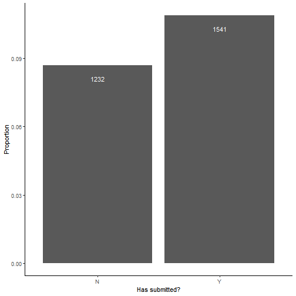

Next, we can create a table of the total daily data:


```r
submitted(daily_records, type = "totals", output = "table")
```

```
## # A tibble: 2 × 2
##   has_submitted     n
##   <chr>         <int>
## 1 N              1232
## 2 Y              1541
```

Switching to season data, we can create a plot first for `type = "totals"`:


```r
submitted(season_totals, type = "totals", output = "plot")
```

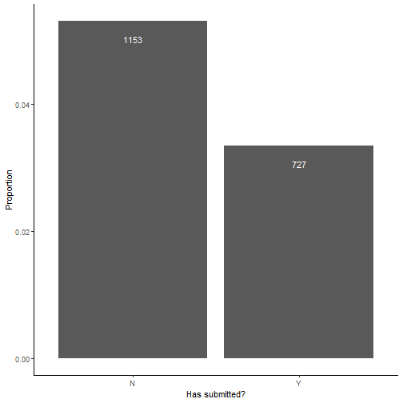

Then create a plot for `type = "state"`:


```r
submitted(season_totals, type = "state", output = "plot")
```

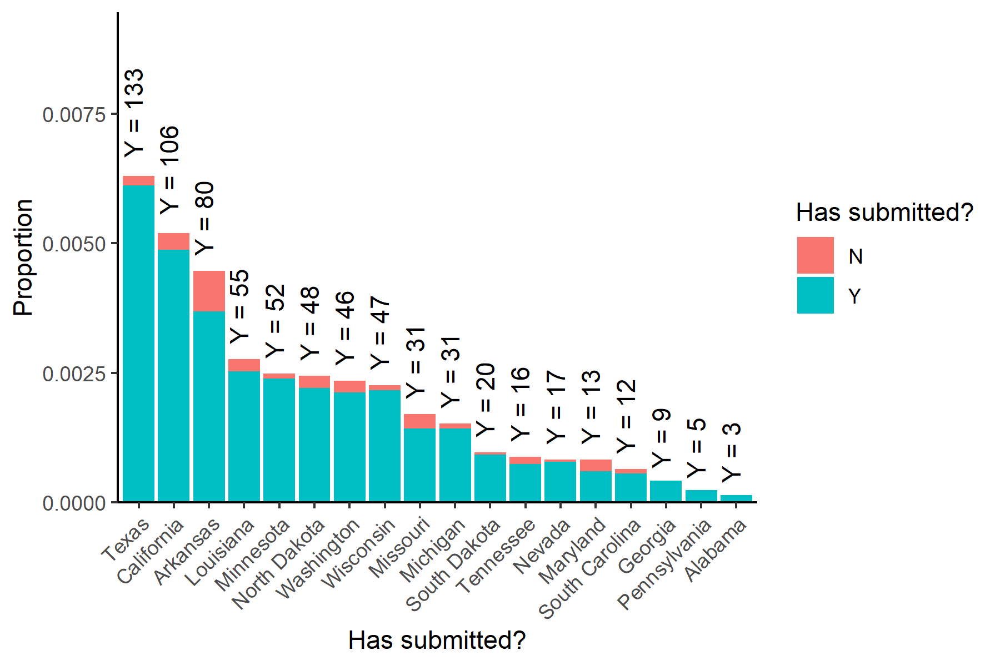

And finally, create a plot for `type = "species"`:


```r
submitted(season_totals, type = "species", output = "plot")
```

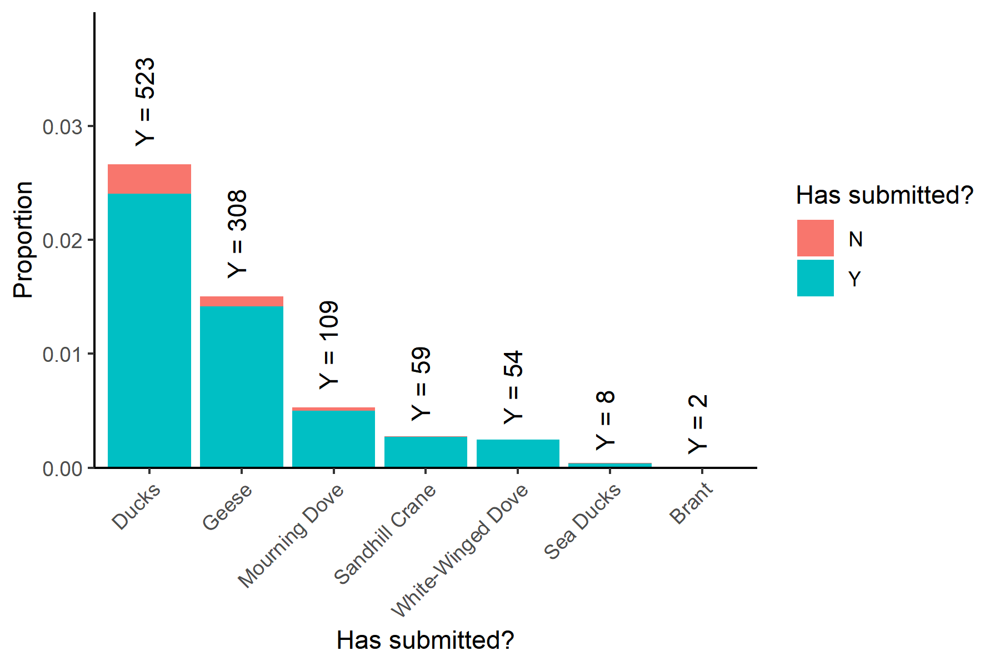


### hunted

The `hunted` function checks the "days_hunted" field in the season totals data or the "has_hunted" field in the daily data. The function takes parameters `type` and `output`. Use `type = "totals"` (default) to view a summary, `type = "state"` to view proportions by state, and `type = "species"` to view proportions by species group. Use `output = "table"` (default) to get a table from the function, or specify `type = "plot"` to get a simple ggplot2 object.

To demonstrate, first we will plot the total daily data:


```r
hunted(daily_records, type = "totals", output = "plot")
```

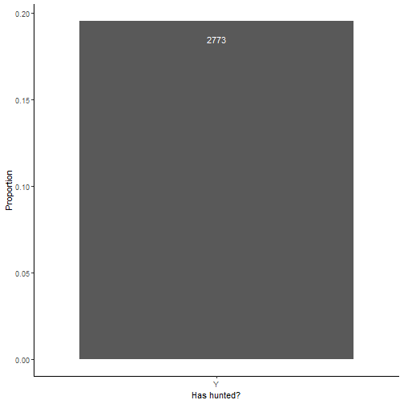

Next, we can create a table of the total daily data:


```r
hunted(daily_records, type = "totals", output = "table")
```

```
## # A tibble: 1 × 2
##   days_hunted     n
##   <chr>       <int>
## 1 1            2773
```

Switching to season data, we can create a plot first for `type = "totals"`:


```r
hunted(season_totals, type = "totals", output = "plot")
```

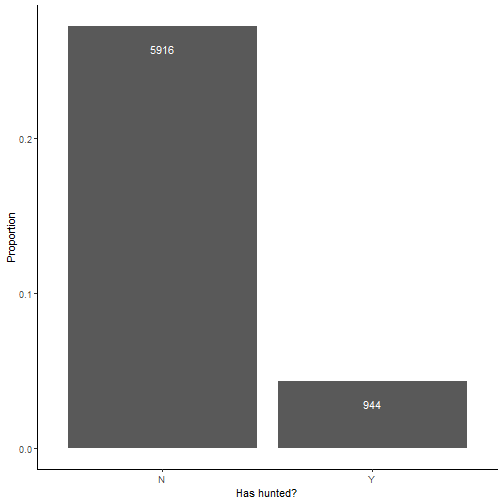

Then create a plot for `type = "state"`:


```r
hunted(season_totals, type = "state", output = "plot")
```

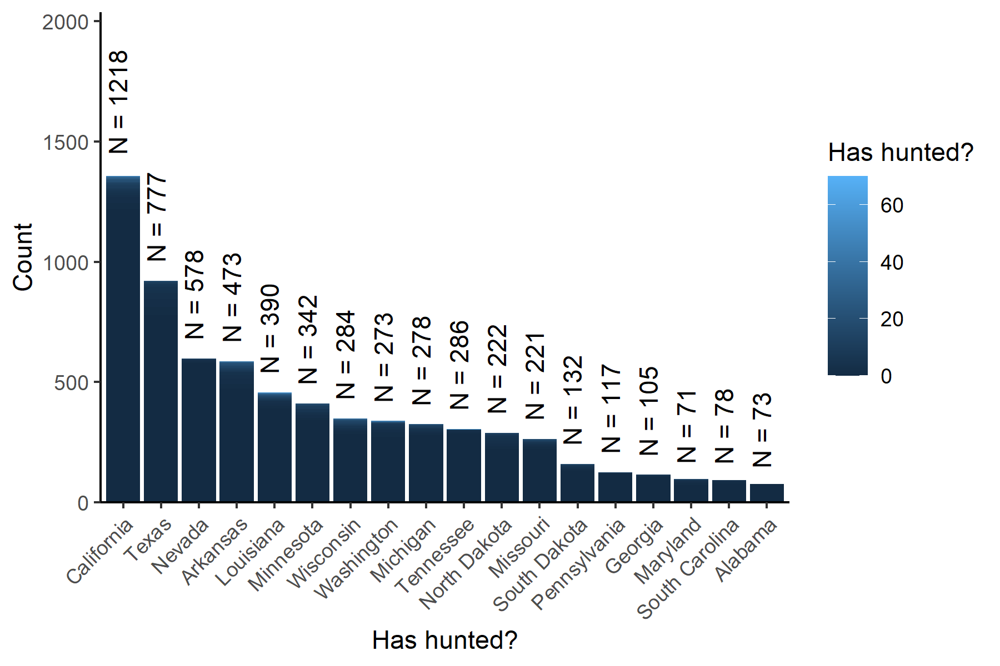

And finally, create a plot for `type = "species"`:


```r
hunted(season_totals, type = "species", output = "plot")
```

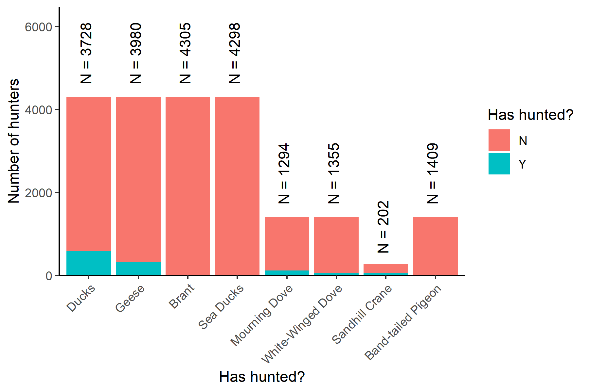

### overdays

The `overdays` function checks daily or season data to determine if total days hunted exceed the length of the state and species' season. If the season data are used in the function, daily data are filtered out of it. This helps to make direct comparisons between them.


```r
overdays(daily_records, ref_data = all_seasons)
```


```
## Error in `mutate()`:
## ℹ In argument: `open_date = mdy(open)`.
## Caused by error in `mdy()`:
## ! could not find function "mdy"
```


```r
overdays(season_totals, ref_data = all_seasons)
```


```
## Error in `mutate()`:
## ℹ In argument: `open_date = mdy(open)`.
## Caused by error in `mdy()`:
## ! could not find function "mdy"
```

### overbags

The `overbags` function checks for retrieved values over the bag limit per state and species in the daily data. All states are reported by default, but a specific state can be returned instead by using the `state` parameter (e.g. `state = "Alabama"`). The `summary` parameter can be set as TRUE to return a table summarized by state and species to report the max, min, and count of overbag values (defaults to FALSE). Lastly, the `over` parameter defaults to TRUE, but can be set as FALSE to return a table of all values (not just the overbags). 

The default settings can be used for a basic output:


```r
overbags(daily_records, ref_data = all_seasons)
```

```
## # A tibble: 128 × 9
##    selected_hunterID surveyID sampled_state county     sp_group_estimated
##                <dbl>    <dbl> <chr>         <chr>      <chr>             
##  1            138144    16720 Minnesota     Brown      Ducks             
##  2            146742    16851 Minnesota     Otter Tail Ducks             
##  3            146742    16851 Minnesota     Otter Tail Ducks             
##  4            146742    16851 Minnesota     Otter Tail Ducks             
##  5            146742    16851 Minnesota     Otter Tail Ducks             
##  6            146742    16851 Minnesota     Otter Tail Ducks             
##  7            146742    16851 Minnesota     Otter Tail Ducks             
##  8            154433    39570 South Dakota  Hamlin     Ducks             
##  9            185088    17349 Minnesota     St Louis   Ducks             
## 10            308507    58944 Washington    Grays Har… Ducks             
## # ℹ 118 more rows
## # ℹ 4 more variables: harvested_date <date>, bag_limit <dbl>,
## #   retrieved <dbl>, unretrieved <chr>
```

Using `summary = TRUE` returns an easy-to-read format:


```r
overbags(daily_records, ref_data = all_seasons, summary = TRUE)
```

```
## # A tibble: 21 × 7
##    sampled_state sp_group_estimated bag_limit   max  mean   min     n
##    <chr>         <chr>                  <dbl> <dbl> <dbl> <dbl> <int>
##  1 Arkansas      Ducks                     11    32  17.8    12    12
##  2 Arkansas      Geese                     20    62  42      22     3
##  3 California    Geese                     20    31  25.3    21     3
##  4 Louisiana     Ducks                     11    55  20.1    12    16
##  5 Maryland      Ducks                      6    13  13      13     1
##  6 Michigan      Ducks                     11    31  18.5    13     6
##  7 Michigan      Geese                     20    34  28      22     2
##  8 Minnesota     Ducks                     11    22  15.8    12     9
##  9 Minnesota     Geese                     20    25  22.3    21     3
## 10 Missouri      Ducks                      6    45  17.8     7     4
## # ℹ 11 more rows
```

And we can specify a state:


```r
overbags(daily_records, ref_data = all_seasons, state = "Arkansas")
```

```
## # A tibble: 15 × 9
##    selected_hunterID surveyID sampled_state county    sp_group_estimated
##                <dbl>    <dbl> <chr>         <chr>     <chr>             
##  1           1040149     1219 Arkansas      Woodruff  Ducks             
##  2           1040149     1219 Arkansas      Cross     Ducks             
##  3           1741611    56530 Arkansas      Monroe    Geese             
##  4           2052902    71303 Arkansas      Arkansas  Ducks             
##  5           2059087    72100 Arkansas      Monroe    Ducks             
##  6           2566099    82950 Arkansas      Unknown   Geese             
##  7           2570123    83419 Arkansas      Boone     Ducks             
##  8           2595713    86802 Arkansas      Prairie   Ducks             
##  9           3105564    10221 Arkansas      Craighead Ducks             
## 10           3108680    10250 Arkansas      Unknown   Ducks             
## 11           3463175    11030 Arkansas      Desha     Ducks             
## 12           3463175    11030 Arkansas      Desha     Ducks             
## 13           4000112    12818 Arkansas      Monroe    Ducks             
## 14           4032629    13221 Arkansas      Arkansas  Ducks             
## 15           4216584    13537 Arkansas      Monroe    Geese             
## # ℹ 4 more variables: harvested_date <date>, bag_limit <dbl>,
## #   retrieved <dbl>, unretrieved <chr>
```

### retrieved

The `retrieved` function summarizes the total number of birds retrieved in the daily or season data. The `output` can be set to "table" (default) or "plot". It can include "state", "species", or "both" (default) by using the `type` parameter. Also, the data can be returned as an `average` using TRUE (default), or return all birds retrieved (`average = FALSE`).

Let's use the most basic version of the function on the daily data:


```r
retrieved(daily_records)
```

```
## # A tibble: 40 × 3
##    sampled_state sp_group_estimated            mean_retrieved
##    <chr>         <chr>                                  <dbl>
##  1 Alabama       Mourning Dove                           12.1
##  2 Alabama       White-Winged Dove                        4  
##  3 Arkansas      Ducks                                   12.4
##  4 Arkansas      Geese                                    3.9
##  5 California    Brant                                    0.2
##  6 California    Ducks                                   21.1
##  7 California    Geese                                    7.4
##  8 California    Specially Regulated Sea Ducks            6  
##  9 Georgia       Mourning Dove                           13  
## 10 Georgia       White-Winged Dove                        3.8
## # ℹ 30 more rows
```

Then plot it:


```r
retrieved(daily_records, output = "plot")
```

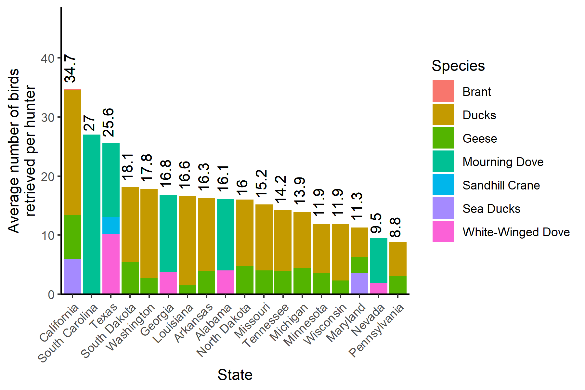

View state only:


```r
retrieved(daily_records, output = "plot", type = "state")
```

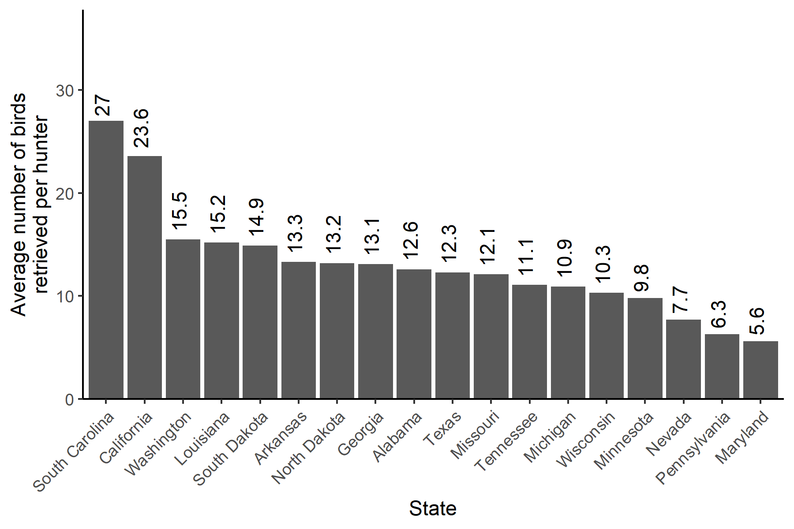

View species only:


```r
retrieved(daily_records, output = "plot", type = "species")
```

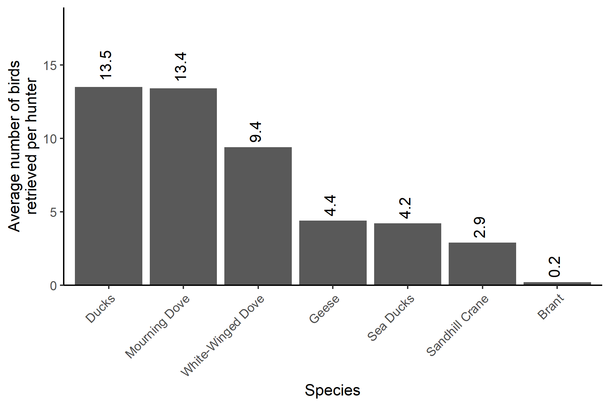

View it without averaging:


```r
retrieved(daily_records, output = "plot", average = FALSE)
```

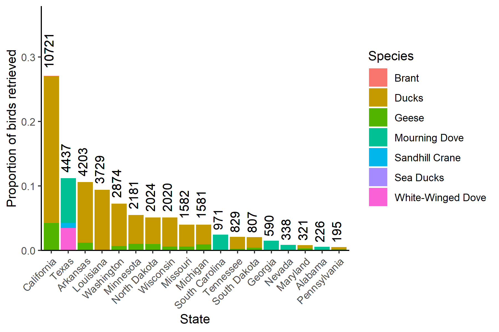

Then plot season data:


```r
retrieved(season_totals, output = "plot")
```

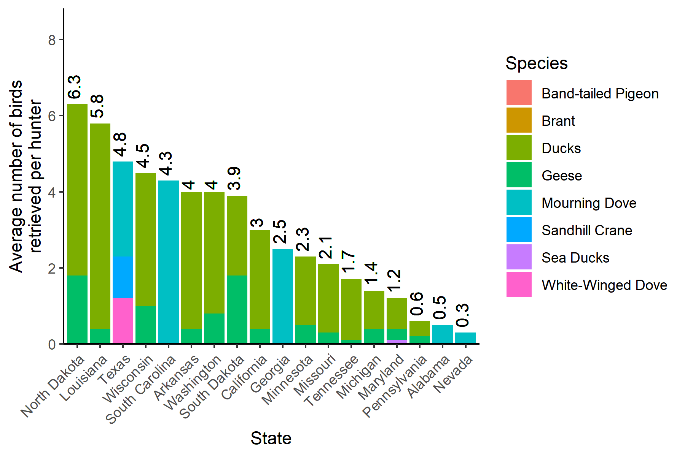

### bagspp

The `bagspp` function summarizes daily data to determine the total number of retrieved birds per hunter. The hunter's data are further broken down to determine which species groups the hunter responded to harvesting.

The default is `output = "table"`:


```r
bagspp(daily_records)
```

```
## # A tibble: 2,773 × 4
##    selected_hunterID n_spp spp_combo   n_retrieved_total
##                <dbl> <int> <chr>                   <dbl>
##  1              2314     1 Ducks                      10
##  2              3219     1 Ducks                       6
##  3              4878     1 Ducks                       4
##  4              4939     2 Ducks-Geese                30
##  5              5123     2 Ducks-Geese                22
##  6              5483     1 Ducks                       8
##  7              6685     1 Ducks                       4
##  8              7789     1 Ducks                      21
##  9              7797     2 Ducks-Geese                32
## 10             10318     2 Ducks-Geese                 2
## # ℹ 2,763 more rows
```

To create a treemap of the number of species groups per hunter, use `output = "n"`:


```r
bagspp(daily_records, output = "n")
```

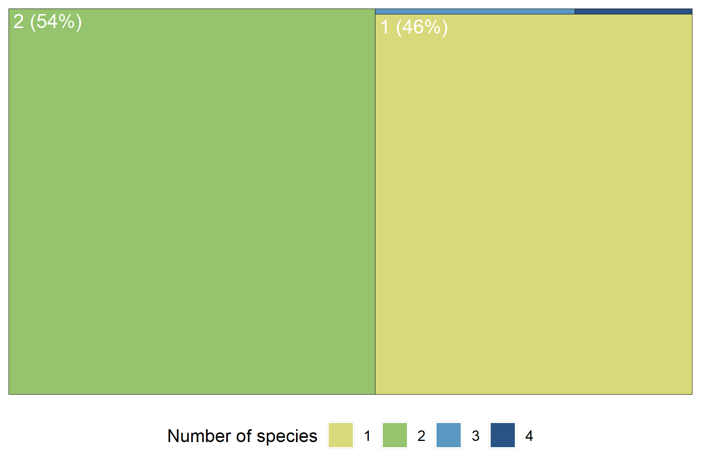

To create a treemap of the species group combinations represented in the data (each hunter's pursued species are grouped), use `output = "species"`:


```r
bagspp(daily_records, output = "species")
```

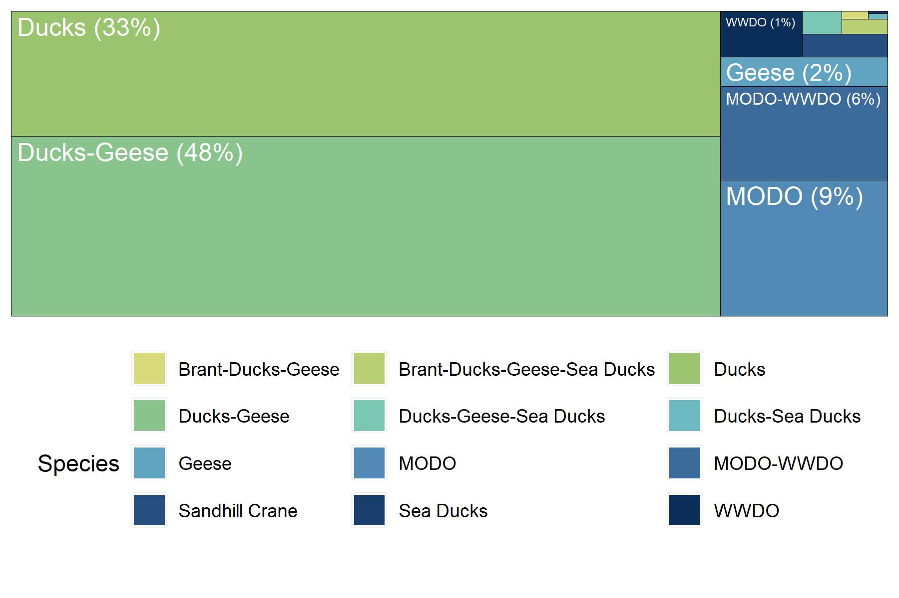

To create a treemap of successful hunts only (the daily data are filtered to exclude retrieved = 0) and view groups of species combinations that were successfully hunted, use `output = "success"`:


```r
bagspp(daily_records, output = "success")
```

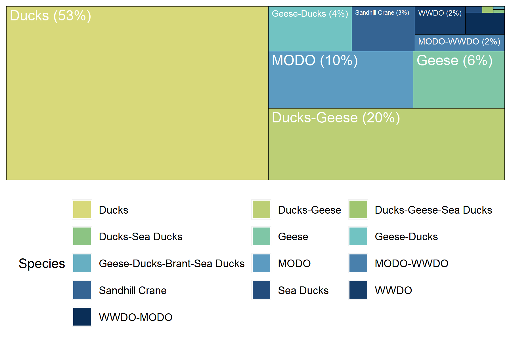

### openclose

The `openclose` function checks if harvest dates fall outside of a state's and species's season in the daily data.

The basic version of the function returns an unsummarized table:


```r
openclose(daily_records, ref_data = all_seasons)
```


```
## Error in `mutate()`:
## ℹ In argument: `open_date = mdy(open)`.
## Caused by error in `mdy()`:
## ! could not find function "mdy"
```

```
## Error in filter(., sp_group_estimated == "MODO-WWDO"): object 'dates' not found
```

```
## Error in filter(., !sp_group_estimated %in% c("MODO-WWDO", "GeeseBrant", : object 'dates' not found
```

```
## Error in is.data.frame(y): object 'dates' not found
```

```
## Error in eval(expr, envir, enclos): object 'date_errors' not found
```


But `summary = TRUE` can be used to get a summary:


```r
openclose(daily_records, ref_data = all_seasons, summary = TRUE)
```

```
## # A tibble: 40 × 4
##    sampled_state sp_group_estimated            error          n
##    <chr>         <chr>                         <chr>      <int>
##  1 Alabama       Mourning Dove                 Early hunt    26
##  2 Alabama       White-Winged Dove             Early hunt     4
##  3 Arkansas      Ducks                         Early hunt  1395
##  4 Arkansas      Geese                         Early hunt   280
##  5 California    Brant                         Early hunt     6
##  6 California    Ducks                         Early hunt  2883
##  7 California    Geese                         Early hunt  1001
##  8 California    Specially Regulated Sea Ducks Early hunt     8
##  9 Georgia       Mourning Dove                 Early hunt    74
## 10 Georgia       White-Winged Dove             Early hunt     5
## # ℹ 30 more rows
```

And the `state` parameter can be used to narrow down to a particular state:


```r
openclose(daily_records, ref_data = all_seasons, state = "Arkansas", summary = TRUE)
```

```
## # A tibble: 2 × 4
##   sampled_state sp_group_estimated error          n
##   <chr>         <chr>              <chr>      <int>
## 1 Arkansas      Ducks              Early hunt  1395
## 2 Arkansas      Geese              Early hunt   280
```

### partyhunt

The `partyhunt` function checks to see if any comments in the daily data indicate that bag values reported were for two or more people. It returns a simple table. This function is a watered down version of [partyproof](#partyproof).


```r
partyhunt(daily_records)
```

```
## # A tibble: 45 × 6
##    sampled_state sp_group_estimated retrieved unretrieved comment        
##    <chr>         <chr>                  <dbl> <chr>       <chr>          
##  1 Minnesota     Ducks                     18 NULL        3 people       
##  2 Minnesota     Ducks                     14 NULL        3 hunters      
##  3 Minnesota     Ducks                     21 NULL        4 hunters      
##  4 Minnesota     Ducks                     22 NULL        4 hunters      
##  5 Minnesota     Ducks                     12 NULL        2 hunters      
##  6 Minnesota     Ducks                      8 NULL        2 hunters      
##  7 Missouri      Ducks                      3 0           2 hunters.  Ja…
##  8 Missouri      Ducks                      2 NULL        2 hunters, saw…
##  9 Tennessee     Ducks                      2 0           Saw a bunch of…
## 10 California    Ducks                      7 1           5mal, 2gad, 31…
## # ℹ 35 more rows
## # ℹ 1 more variable: party_size <chr>
```

### huntdays

The `huntdays` function summarizes the total number of days hunted in the daily data. The `output` can be set to "table" (default) or "plot". It can include "state", "species", or "both" (default) by using the `type` parameter. Also, the data can be returned as an `average` using TRUE (default), or return all days hunted (`average = FALSE`).

Let's use the most basic version of the function on the daily data:


```r
huntdays(daily_records)
```

```
## # A tibble: 40 × 3
##    sampled_state sp_group_estimated            mean_days
##    <chr>         <chr>                             <dbl>
##  1 Alabama       Mourning Dove                       1.4
##  2 Alabama       White-Winged Dove                   2  
##  3 Arkansas      Ducks                               4.7
##  4 Arkansas      Geese                               2.3
##  5 California    Brant                               1.5
##  6 California    Ducks                               6.7
##  7 California    Geese                               4.4
##  8 California    Specially Regulated Sea Ducks       2  
##  9 Georgia       Mourning Dove                       1.7
## 10 Georgia       White-Winged Dove                   1  
## # ℹ 30 more rows
```

Then plot it:


```r
huntdays(daily_records, output = "plot")
```

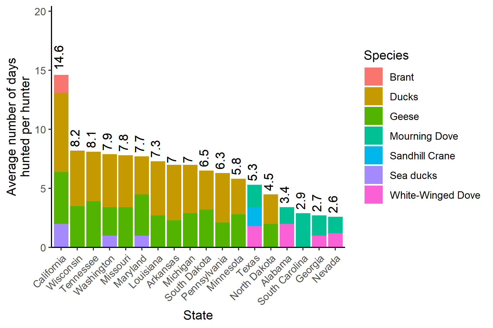

View it without averaging:


```r
huntdays(daily_records, output = "plot", average = FALSE)
```

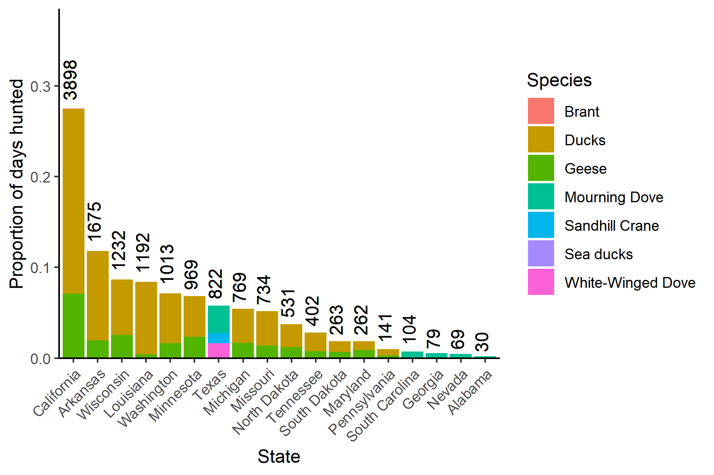

View state only:


```r
huntdays(daily_records, output = "plot", type = "state")
```

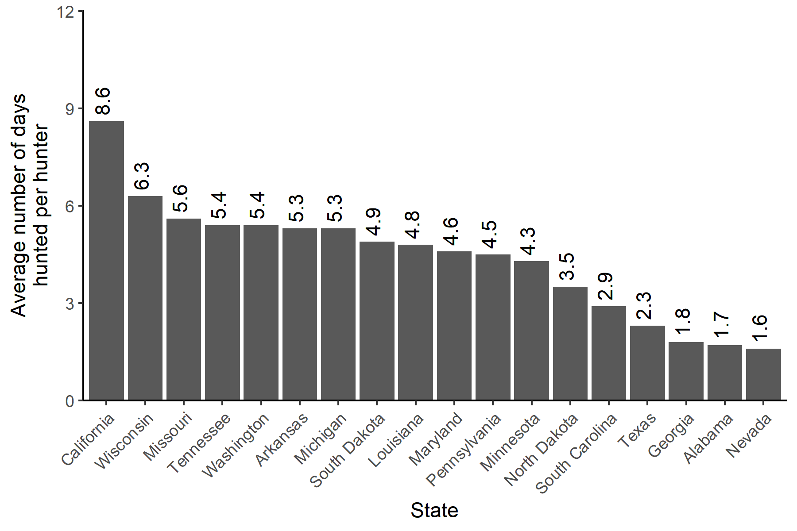

View species only:


```r
huntdays(daily_records, output = "plot", type = "species")
```

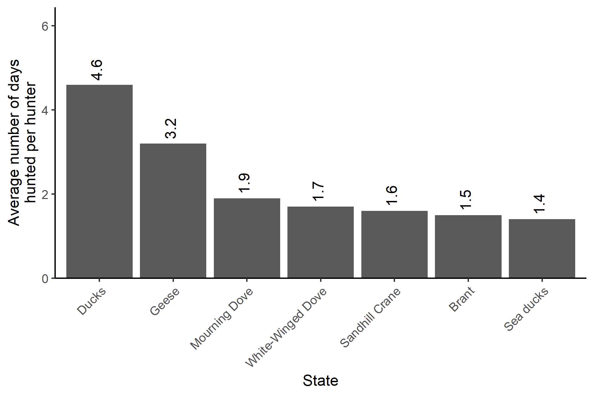

### compare

The `compare` function takes 2 data tables (daily and season) to plot 3 data fields (bag size, number of birds retrieved, number of days hunted) and breaks those data into 4 groups: season submitted, daily submitted, season non-submit, and daily non-submit.

There are 3 types of plots that can be generated from this function.

The first is `type = "line"`:


```r
compare(daily_records, season_totals, type = "line")
```

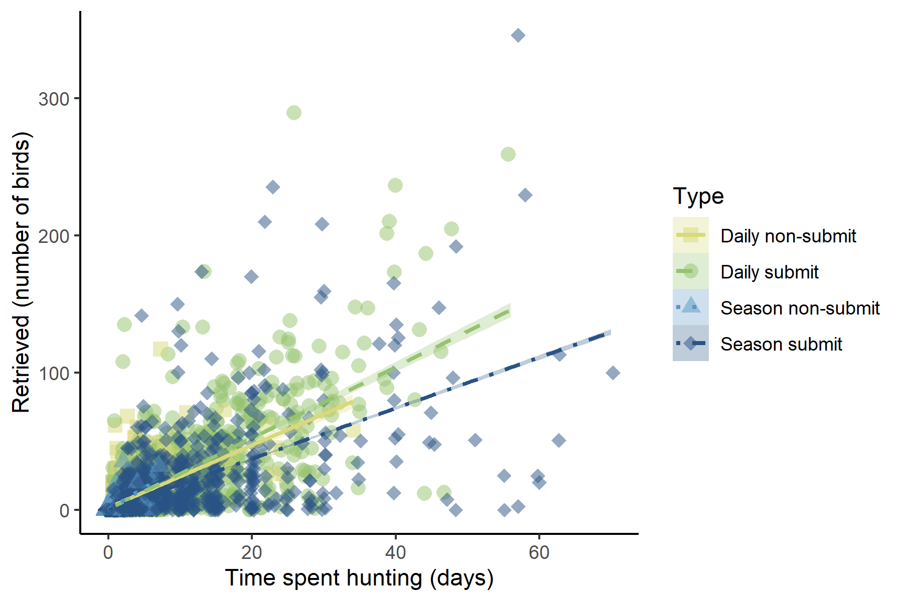

The next is `type = "days"`:


```r
compare(daily_records, season_totals, type = "days")
```

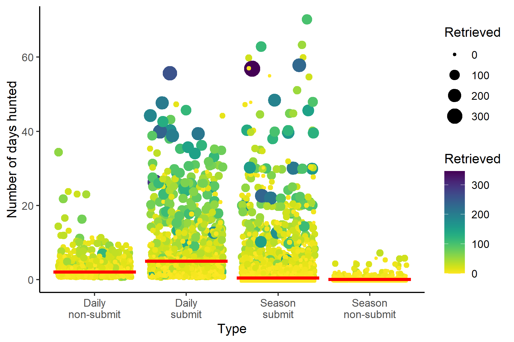

And the last is `type = "retrieved"`:


```r
compare(daily_records, season_totals, type = "retrieved")
```

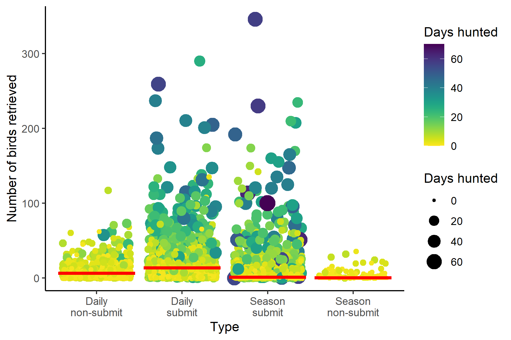


### retrievedmap

The `retrievedmap` function creates a hex bin map of the United States from daily Harvest Survey data. Maps are plotted in a grid to display all species. States that are red have the highest mean harvest, states that are yellow have the lowest mean harvest, and blank (or white) states have no data. The default `output = "grid"` returns one image, but `output = "series"` can be used alternatively in the R console to view and export each species individually.


```r
retrievedmap(daily_records, output = "grid")
```

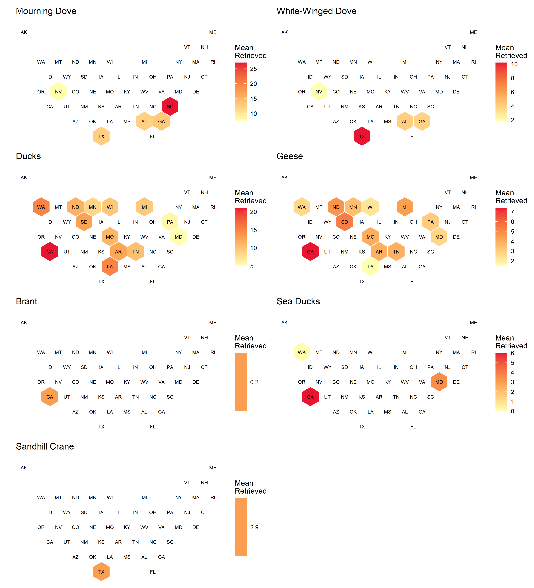

### bagdays

The `bagdays` function determines the total number of days hunted per hunter and species group in the daily data. The default `output = "table"` returns a table. Use `output = "plot"` to return a ggplot object.


```r
bagdays(daily_records, output = "plot")
```

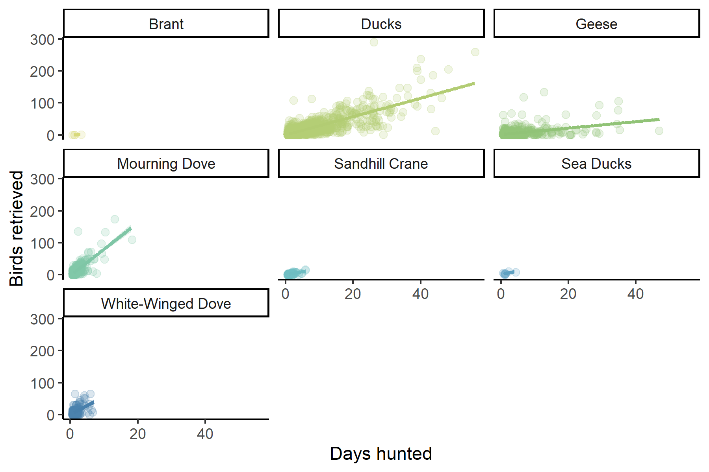

```r
bagdays(daily_records, output = "table")
```

```
## # A tibble: 3,778 × 4
##    selected_hunterID sp_group_estimated n_days n_retrieved
##                <dbl> <chr>               <int>       <dbl>
##  1              2314 Ducks                   8           9
##  2              3219 Ducks                   3           5
##  3              4878 Ducks                   1           3
##  4              4939 Ducks                   5          26
##  5              4939 Geese                   1           2
##  6              5123 Ducks                   5          19
##  7              5123 Geese                   1           1
##  8              5483 Ducks                   3           7
##  9              6685 Ducks                   1           3
## 10              7789 Ducks                  11          20
## # ℹ 3,768 more rows
```

### responselag

The `responselag` function creates plots to visualize the amount of time between hunt date and response date in daily data. Three types of plots can be returned from this function. 

Use `type = "count"` to view the distribution of response lag:


```r
responselag(daily_records, type = "count")
```

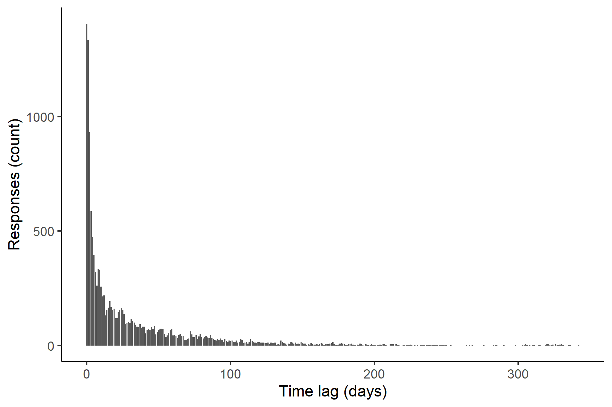

Use `type = "lag"` to view the relationship between response lag and the number of birds retrieved:


```r
responselag(daily_records, type = "lag")
```

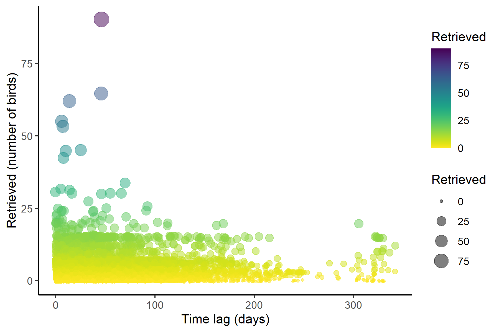

And use `type = "date"` to view the relationship between date of response and date of harvest:


```r
responselag(daily_records, type = "date")
```

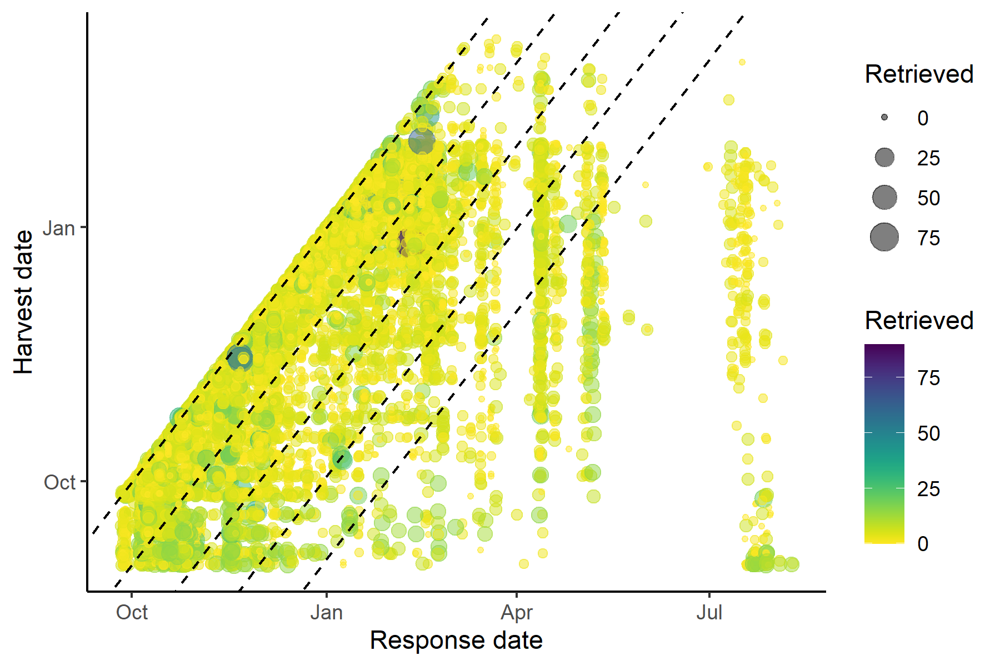

## Part C: Data Proofing and Report Writing

### partyproof

The `partyproof` function checks for, and allows the user to edit, any group hunts in the daily data. Comments are parsed to determine party size. Adjustments to number of birds retrieved must be entered manually, and if deemed necessary, the retrieved value will be divided by the party size. A report file is written out as a .csv to record all changes made.


```r
proofed_parties <- 
  partyproof(
    data = daily_records, 
    ref_data = all_seasons, 
    outpath = "C:/HarvestSurvey/vignette/clean_data/party_proofed.csv")
```

### proofHS

The `proofHS` function checks for overbag and overdays values in the Harvest Survey season data. In addition to overbag and overdays, daily data are checked for early and late hunts.

For daily data, specify the output from `partyproof` for `data`.


```r
daily_proofed <- 
  proofHS(
    data = proofed_parties, 
    ref_data = all_seasons)
```

For season data, use the season data table for `data`.


```r
season_proofed <-
  proofHS(
    data = season_totals, 
    ref_data = all_seasons)
```

### reportHS

The `reportHS` function creates documentation with figures and tables that summarize daily and season data. Parameters include:

- `daily` - name of daily data table in environment
- `season` - name of season data table in environment
- `ref_data` - name of reference data table in environment
- `partypath` - file path to the .csv containing results from the `partyproof` function
- `year` - hunting season for which data were collected
- `outpath` - folder in which to save the completed report
- `file` - what the report file should be named

There are two templates that can generate reports: an annual summary report (`type = "season_report"`)...


```r
reportHS(
  daily = daily,
  season = season,
  ref_data = all_seasons,
  partypath = "C:/HarvestSurvey/vignette/clean_data/party_proofed.csv",
  type = "season_report",
  year = "2020",
  outpath = "C:/HarvestSurvey/vignette/reports/",
  file = "HS_annual_summary_report_2020.html"
)
```

.. and a survey analytics report (`type = "survey_analytics"`). 


```r
reportHS(
  daily = daily,
  season = season,
  ref_data = all_seasons,
  partypath = "C:/HarvestSurvey/vignette/clean_data/party_proofed.csv",
  type = "survey_analytics",
  year = "2020",
  outpath = "C:/HarvestSurvey/vignette/reports/",
  file = "HS_annual_summary_report_2020.html"
)
```

## Troubleshooting

### Issue reporting

If you find a bug in the package, it's advised to [create an issue](https://github.com/USFWS/migbirdMBHS/issues) at the package's GitHub repo, https://github.com/USFWS/migbirdMBHS.

<b>Questions?</b>

Contact Abby Walter, abby_walter@fws.gov

